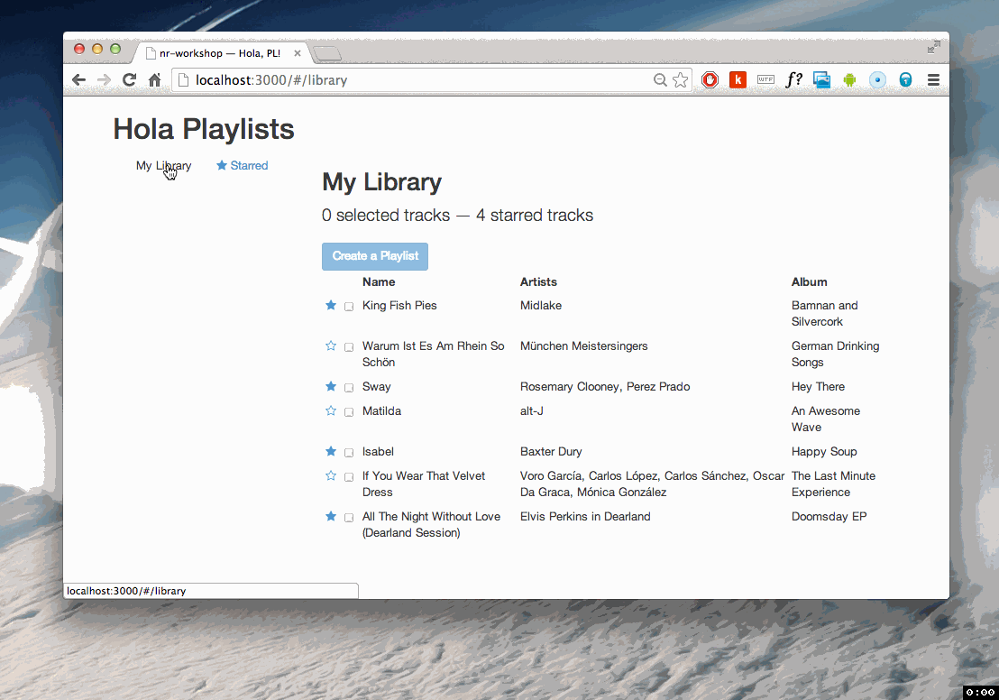

# Hola, Playlists.




## New Relic's Angular Workshop

The main purpose of this Rails project is to serve the JavaScript assets which make up the client side app.

### Quick Start

```
git clone git@github.com:vicentereig/nr-workshop.git
cd nr-workshop
rvm install ruby-2.0.0-p247 --verify-downloads 1
cd ..
cd nr-workshop # reloads gemset
bundle install
rails s
```

### Project Layout

1. `app/view/application/index.html.haml`: Bootstraps the angular app main module defined in `app/assets/javascripts/application/app.js`.
2. `app/assets/javascripts/application/index.js`: Rails Asset Pipeline manifest defining third party dependencies. http://guides.rubyonrails.org/asset_pipeline.html#using-index-files
3. `app/assets/javascripts/application/loaders/tracks.js`: The model factory we'll be using for Tracks.
4. `app/assets/javascripts/application/loaders/playlist.js`: The model factory we'll be using for Playlists.
5. `app/assets/javascripts/application/routes/routes.js`: Tells the main route to instantiate the root controller and bind it to `application/templates/library/index.html`

### References

1. `dotJEM/angular-routing`: https://github.com/dotJEM/angular-routing
2. http://dotjem.github.io/angular-routing/#/docs/api/dotjem.routing.$state
2. `$watch` documentation: http://docs.angularjs.org/api/ng.$rootScope.Scope#methods_$watch
3. `$watchCollection` documentation: http://docs.angularjs.org/api/ng.$rootScope.Scope#methods_$watchcollection
4. Sharing data between controllers using `$scope` inheritance: https://egghead.io/lessons/angularjs-sharing-data-between-controllers


